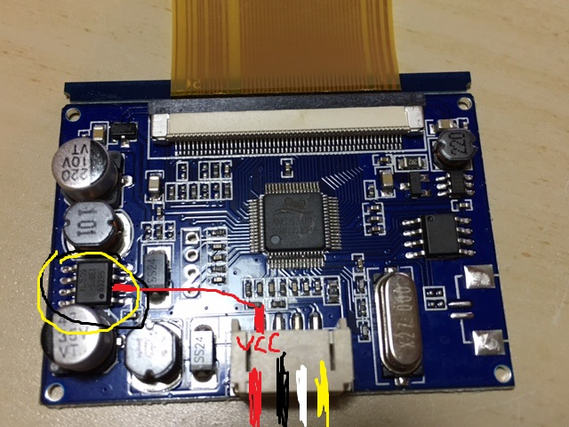

# Game Boy Zero

Game Boy Zero is a DIY handheld console done inside a Game Boy housing with a Raspberry Pi Zero.

These instructions are for a variant using a Raspberry Pi 3, for better performance.

## Original project site and forums

- [SudoMod](https://sudomod.com/)
- [Sota's variant](https://sudomod.com/forum/viewtopic.php?f=9&t=1615)
- [Info on screens](https://www.sudomod.com/forum/viewtopic.php?f=8&t=15&hilit=gearbest&start=520)
- [Screen performance](https://www.sudomod.com/forum/viewtopic.php?f=8&t=2850)

## Other resources

- [RPi pinout](http://pinout.xyz)

## Parts list

| Parts                                   | Price   |
| --------------------------------------- | ------- |
| Raspberry Pi 3                          | 36€     |
| Original Game Boy Housing (DMG Housing) | 4€      |
| Additional Game Boy buttons             | 3€      |
| 2x Game Boy conductive rubber           | 6€      |
| Game Boy DMG 4 button PCB               | 10€     |
| [Gearbest 3.5'' screen](https://www.gearbest.com/development-boards/pp_29447.html) | 17€ |
| **Total**                               | **59€** |

## Installing retropie

1. Get [retropie](https://retropie.org.uk/)
2. Flash retropie to an SD Card and configure it with a keyboard and screen

Keys:

`TODO keys`

`TODO theme`

`TODO resolution`

## Housing

1. Enlarge the screen area so the 3.5'' screen fits.
2. Open space for the X and Y buttons.
3. Cut away the battery frame so that the Raspberry Pi 3 fits.

## Screen

1. Solder the screen's yellow cable (AV2) to PP24 on RPi (Composite video)
2. Solder the screen's red cable to RPi VCC
3. Solder the screen's black cable to RPi GND

Remember to keep the black insolating rubber whenever possible, to shield the AV2 connection from VCC interference.
Alternatively, redo the connections keeping AV2 and GND together and shielded, with VCC out.

If the screen displays poorly, try disabling the screen's voltage regulator from 12V to 5V, by shorting one of the pins of a chip:

## Buttons

1. Get [Adafruit's retrogame](https://github.com/adafruit/Adafruit-Retrogame) to translate GPIO buttons to keyboard events
2. Copy retrogame to the retropie
3. Copy the correct configuration to /boot/retrogame.cfg:

`TODO cfg`
