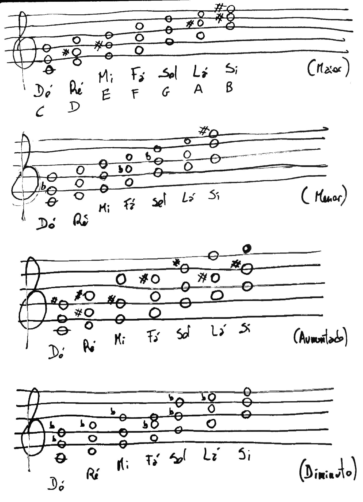

# Guitar

## Tips

- Fingers in the left hand are numbered 1-4, where 1 is the index finger and 4 is the pinky.
- Help with fingers 1 and 2 when you do the bend with finger 3. Avoid bending with finger 4.
- Typically, the Bridge pickup is used more in Lead guitars, and the Neck pickup in Rhythm guitars.

## Notes

Each fret represents a semitone. Two frets is a full tone.
From B (Si) and E (Mi) to a higher note, you only move one semitone (1 fret).

```sql
La Si Do Re Mi Fa Sol
A  B  C  D  E  F  G
```


## Chords

Each chord is composed of three (or more) notes. We can play 3-note chords in all 6 strings by repeating the notes in other strings.

- **Major** chords: Root note + Major third + Minor third  (happy chords)
- **Minor** chords: Root note + Minor third + Major third  (sad chords)
- **Augmented** chords: Root note + Major third + Major third
- **Diminished** chords: Root note + Minor third + Minor third

A **major third** is an interval of 2 tones.
A **minor third** is an interval of 1.5 tones.




### A Chords

```sql
A                Am
  E A D G B e      E A D G B e
  x o 2 2 2 o      x o 2 2 1 o
  ===========      ===========
1 | | | | | |    1 | | | | 1 |
2 | | 2 1 3 |    2 | | 2 3 | |
3 | | | | | |    3 | | | | | |
```

### A# / Bb Chords

```sql
Bb
  E A D G B e
  x 1 3 3 3 1
  ===========
1 | 1 | | | 1
2 | | | | | |
3 | | 2 3 4 |
```

### B Chords

```sql
B                Bm               B7
  E A D G B e      E A D G B e      E A D G B e
  x 2 4 4 4 2      x 2 4 4 3 2      x 2 1 2 o 2
  ===========      ===========      ===========
1 | | | | | |    1 | | | | | |    1 | | 1 | | |
2 x 1 | | | 1    2 x 1 | | | 1    2 | 2 | 3 | 4
3 | | | | | |    3 | | | | 2 |    3 | | | | | |
4 | | 2 3 4 |    4 | | 3 4 | |
```

### C Chords

```sql
C                Cm               C7
  E A D G B e      E A D G B e      E A D G B e
  x 3 2 o 1 o      x 3 5 5 4 3      x 3 2 3 1 o
  ===========      ===========      ===========
1 | | | | 1 |    1 | | | | | |    1 | | | | 1 |
2 | | 2 | | |    2 | | | | | |    2 | | 2 | | |
3 | 3 | | | |    3 | 1 | | | 1    3 | 3 | 4 | |
                 4 | | | | 2 |
                 5 | | 3 4 | |
```

### D Chords

```sql
D                Dm
  E A D G B e      E A D G B e
  x x o 2 3 2      x x o 2 3 1
  ===========      ===========
1 | | | | | |    1 | | | | | 1
2 | | | 1 | 2    2 | | | 2 | |
3 | | | | 3 |    3 | | | | 3 |
```

### E Chords

```sql
E                Em
  E A D G B e      E A D G B e
  o 2 2 1 o o      o 2 2 o o o
  ===========      =========== 
1 | | | 1 | |    1 | | | | | |
2 | 2 3 | | |    2 | 2 3 | | |
3 | | | | | |    3 | | | | | |

                Or:  1 2
```

### F Chords

```sql
F                Fm               Fmaj7
  E A D G B e      E A D G B e      E A D G B e
  1 3 3 2 1 1      1 3 3 1 1 1      x 3 3 2 1 o
  ===========      ===========      ===========
1 1 | | | 1 1    1 1 | | 1 1 1    1 | | | | 1 |
2 | | | 2 | |    2 | | | | | |    2 | | | 2 | |
3 | 3 4 | | |    3 | 3 4 | | |    3 | 3 4 | | |
```

### G Chords

```sql
G                G                G7
  E A D G B e      E A D G B e      E A D G B e
  3 2 o o o 3      3 2 o o 3 3      3 2 o o o 1
  ===========      ===========      ===========
1 | | | | | |    1 | | | | | |    1 | | | | | 1
2 | 1 | | | |    2 | 1 | | | |    2 | 2 | | | |
3 2 | | | | 3    3 2 | | | 3 4    3 3 | | | | |
```


### Power Chords

The lowest note defines the chord, use always the same shape.

```sql
F                B (tip of index mutes the E string)
  E A D G B e      E A D G B e
  1 3 3 x x x      x 2 4 4 x x
  ===========      ===========
1 1 | | | | |    1 | | | | | |
2 | | | | | |    2 x 1 | | | |
3 | 3 4 | | |    3 | | | | | |
                 4 | | 3 4 | |
```

### Octaves

Power chords with muted string in the middle (use index or tip of 3rd finger to mute).

```sql
F                B
  E A D G B e      E A D G B e
  1 x 3 x x x      x 2 x 4 x x
  ===========      ===========
1 1 | | | | |    1 | | | | | |
2 | | | | | |    2 x 1 | | | |
3 | x 3 | | |    3 | | | | | |
                 4 | | x 3 | |
```


## Scales

Scales are alphabets of notes (letters) to create licks (words) to compose solos or improvise.

### Pentatonic (e.g. A minor)

```sql
e -o-||-------o-----o--------o-----o-----o--------o---
B ---||-o-----o-----o--------o----(1)------(4)----o---
G -o-||----o--------o-----o----(1)-------o-----o------
D -o-||----o--------o-----o--------o-----o-----o------
A -o-||-------o-----o-----o--------o-----o--------o---
E -o-||------(2)---(1)------(2)---(2)---(1)------(2)--
   0    1  2  3  4  5  6  7  8  9 10 11 12 13 14 15 16
                    A        C
            (Minor root)  (Major root)
```

(Numbers in parentheses indicate which finger to play the note in the separate hand positions)


## Tunings

### Standard tuning

EADGBE

### Drop C tuning (D Drop C)

Everything is one note lower, except the 6th string which is another note lower.

CGCFAD

## Tuning without a tuner

For both these methods you should first tune your 6th string (the thickest) to a reference note or a tuner if possible.
Otherwise, your guitar will be in tune with itself but not with others.

### String notes

- 6th string, 5th fret = 5th string, open
- 5th string, 5th fret = 4th string, open
- 4th string, 5th fret = 3rd string, open
- 3rd string, 4th fret = 2nd string, open
- 2nd string, 5th fret = 1st string, open

### Harmonics

- 6th string, 5th harmonic = 5th string, 7th harmonic
- 5th string, 5th harmonic = 4th string, 7th harmonic
- 4th string, 5th harmonic = 3rd string, 7th harmonic
- 6th string, 7th harmonic = 2nd string, open = 2nd string, 12th harmonic
- 6th string, 5th harmonic = 1st string, open
