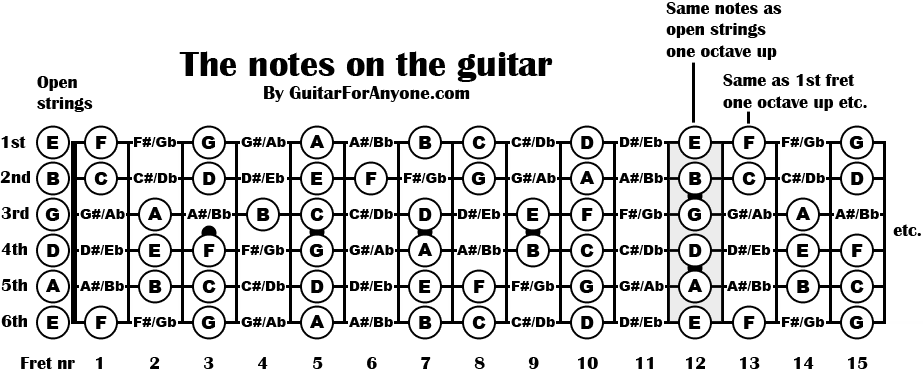
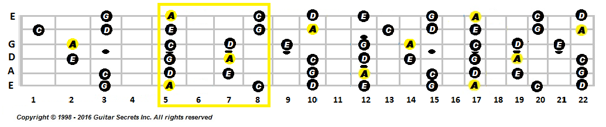

# Private Guitar Lessons

Prof: Bruno Teixeira (Escola Semibreve)

## Notas

Cada subida de tom são 2 trastes.
De B (Si) e E (Mi) para a próxima nota só se sobe meio tom (1 traste).

```sql
La Si Do Re Mi Fa Sol
A  B  C  D  E  F  G
```




## Escalas

### Escala pentatónica (exemplo para A menor)

```sql
e -o-||-------o-----o--------o-----o-----o--------o---
B ---||-o-----o-----o--------o----(1)------(4)----o---
G -o-||----o--------o-----o----(1)-------o-----o------
D -o-||----o--------o-----o--------o-----o-----o------
A -o-||-------o-----o-----o--------o-----o--------o---
E -o-||------(2)---(1)------(2)---(2)----o-------(2)--
   0    1  2  3  4  5  6  7  8  9 10 11 12 13 14 15 16
                    A        C
            (Minor root)  (Major root)
```




### Dicas do Justin TV

Utilizar o dedo 3 em vez do mindinho para string bending. O polegar poderá ter de subir na parte de cima do braço para ajudar.

#### Álbuns de Blues

- [B.B. King - Live at the Regal](https://open.spotify.com/album/7njGz7ZeDXL6cH3VnflcQ2)
- [Stevie Ray Vaughan - Texas Flood](https://open.spotify.com/album/1AL5oXZRtTc8PyhcTwg4xQ)
- [Eric Clapton, John Mayall & The Bluesbreakers - Bluesbreakers](https://open.spotify.com/album/4bSvzPMgzwvfqHAbcWG88o)
- [Albert King - Born Under a Bad Sign](https://open.spotify.com/album/0Ez9S8Dhzr1fa6ZCkcIJiR)

#### Backing tracks

- [Blues Am](https://www.youtube.com/watch?v=9H2oY_85q8U)
- [Blues Am](https://youtu.be/Z3euxRLOQec)
- [Blues Am parecido aos acordes](https://www.youtube.com/watch?v=_pHhJhqfZcc)

### Licks
```sql
e ----
B ----
G -7⤴-
D ----
A ----
E ----

e ----
B -8--
G -7⤴-
D ----
A ----
E ----

e -8⤴-8⤴-5   (second bend is just a curl, minimum bend; end with vibratto)
B --------
G --------
D --------
A --------
E --------

e --------
B --------
G -7⤴-5--- (end with vibratto)
D --------
A --------
E --------

e -------5---
B ----5----8⤴
G -7⤴--------
D -----------
A -----------
E -----------

e ----5-------------
B -8⤴---8(p.o.)5--8⤴
G ------------------
D ------------------
A ------------------
E ------------------

e -5-----------------------
B ----8(p.o.)5-----5-------
G --------------7----5⤴----  (curl)
D -----------------------7-
A -------------------------
E -------------------------
```


## Power chords

Normalmente dedo 1 + dedo 3, mas quando se pretende mais tarde fazer a abertura de 5 a 9 (por exemplo), convém ser o dedo 2 a abrir dois trastes.  
Nesse caso toca-se dedo 1 + dedo 2 o power chord inicial logo.

### A (La)

```sql
e  x  x
B  x  x
G  x  x
D  x  x
A  7  9
E  5  5
```

### D (Re)

```sql
e  x  x
B  x  x
G  x  x
D  7  9
A  5  5
E  x  x
```

### E (Mi)

```sql
e  x  x
B  x  x
G  x  x
D  9 11
A  7  7
E  x  x
```

Boa backing track:

(Cada letra representa downstroke + upstroke, excepto as 3 últimas)

```bash
A A(9) A A(9) A A(9) A A(9), A A(9) A A(9) A A(9) A A(9)
D D(9) D D(9) D D(9) D D(9)
A A(9) A A(9) A A(9) A A(9)
E E(11) E E(11), D D(9) D D(9)
A A(9) A A(9), D↓↑ D#↓ E↑
```
