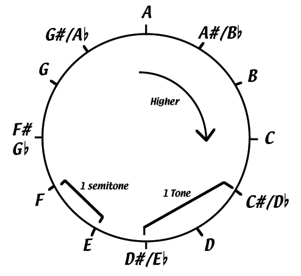

# Music Theory

## Note names between Portuguese and English
```
La Si Do Re Mi Fa Sol
A  B  C  D  E  F  G
```

## The Note Circle

As taught by Justin Sandercoe from http://www.justinguitar.com.  
Each step along the circle is a semitone, and a fret on the guitar.



Notice how B and E don't have sharps before the next note.

## Scales

### Major Scale

To construct a major scale:

1. Choose a root note
2. Produce the next notes with the recipe: WWHWWWH (W: whole tone, H: semitone)
3. Each note in a scale is given a number 1-7
4. The 2nd, 3rd and 6th notes are minor (m). The 7th is diminished (º). The rest are major.
5. You can write them as roman numerals to symbolize major chords as uppercase and minor chords as lowercase.

E.g. for C Major:

| Note            | **C** | Dm | Em  | F  | G | Am | Bº   |
| --------------- | ----- | -- | --- | -- | - | -- | ---- |
| Number in scale | 1     | 2  | 3   | 4  | 5 | 6  | 7    |
| Major/minor     | I     | ii | iii | IV | V | vi | viiº |

Each Major Scale relates to a Minor Scale 1.5 tones lower.

So the relative scale for A Minor:

| Note            | **Am** | Bº  | C   | Dm | Em | F  | G   |
| --------------- | ------ | --- | --- | -- | -- | -- | --- |
| Number in scale | 1      | 2   | 3   | 4  | 5  | 6  | 7   |
| Major/minor     | i      | iiº | III | iv | v  | VI | VII |


#### Diatonic chords

Chords in the same notes of the scale are called Diatonic Chords. A good rule of thumb for chord progressions using those chords:
- Start with the root note chord (I)
- End with chord IV (Plagal Cadence) or V (Authentic Cadence)

## Time Signatures

Time signatures define the essential rhythm of the song. The first beat of the bar is the **downbeat** and generally denotes a more powerful sound. The **upbeat** is the beat that precedes the downbeat.

- 4/4: Four beats per measure (bar; *compasso*)
- 3/4: Three beats per measure (waltz)
- 2/4: Two beats per measure (march)
- 6/8: Like waltz, but the 4th beat is not as strong as the first


## Blues

### 12-Bar blues

Composed by 12 bars of the following Major Chords in the key: I I I I IV IV I I V IV I I

Because Major Chords are so bright, we can replace them with Dominant Seventh chords for a more Blues-y feel (add a flatted seventh note to the Major Chord).

#### Quickchange

Use the IV chord in the second beat: I IV I I IV IV I I V IV I I

#### Turnaround

Finish with other chords than the first: I I I I IV IV I I V IV I V
